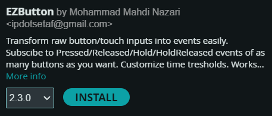
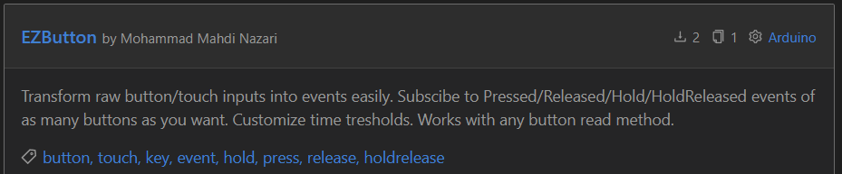

<p align=left>
   <a href="https://registry.platformio.org/libraries/ipdotsetaf/EZButton"></a>
   <a href="https://www.ardu-badge.com/EZButton"></a>
   
   
   
   
   <!---->
</p>

# EZButton
Arduino library that transforms raw button/touch inputs into events easily.

Subscribe to Pressed/Released/Hold/HoldReleased events with as many buttons as you want. Customize time thresholds and debouncing. Works with any button read method.

> [!IMPORTANT]
> If you found this library helpful, please consider leaving a Star⭐
> 
> It helps a lot in maintaining the project ❤️

## Features
- Flexibility
    - Works with:
        - Buttons
        - Touch
        - Any other signal
    - Also works with:
        - Pulling
        - Multiplexing
        - Interrupts
        - AnalogReads
        - etc
- Event Subscription: You can subscribe to any of the following events for any button:
    - Pressed
    - Released
    - Hold
    - Hold Released
- Unlimited Buttons/Touches: You can configure as many buttons as you need.
- Input signal Debouncing.
- Customizability: You can change any of the time thresholds to customize your user experience.
    - `HoldThreshold`: The time it takes before the first `HOLD` event is executed after the button is held down.
    - `HoldInterval`: The Time Interval that corresponds to the `HOLD` event being executed repeatedly after the first `HOLD` event was registered.
    - `DebounceTime`: The Time that is used to debounce input signal.
- Debugging: Easily enable/disable logging for all button states and events.
- Serial Output Customization: You can change the serial Output used for logging.
- Blackout Time: Disable any event execution for the given amount of time.

## How To
### Installation
This Library is available in `Arduino Library Repository` and `PIO` and you can install it from: 
- Arduino IDE Library Manager



- PlatformIO Libraries
  


`ipdotsetaf/EZButton@^2.3.0`
### Usage

1. Include the library
``` C++
#include <EZButton.h>
```
2. Create an object from `EZButton`
``` C++
#define BTN_1 0
#define BTN_2 1
#define BTN_3 2
#define BTN_4 3
//config for 4 buttons
//Read button states from the 'ReadButtons' function
//HoldThreshold: 500ms
//HoldInterval: 300ms
//DebounceTime: 15ms
EZButton _ezb(4, ReadButtons, 500, 300, 15);
```
3. Initialize your buttons/touches however you want.
4. Attach any Interrups if needed.
5. Subscribe to any event you need
``` C++
//Define your pinModes
//...

//button event subscribtion
//button index, function to execute, event type
_ezb.Subscribe(BTN_1, Btn1HoldRelease, HOLD_RELEASED);
_ezb.Subscribe(BTN_2, Btn2Release, RELEASED);
_ezb.Subscribe(BTN_3, Btn3Hold, HOLD);
_ezb.Subscribe(BTN_3, Btn3Release, RELEASED);
_ezb.Subscribe(BTN_4, Btn4Hold, HOLD);
_ezb.Subscribe(BTN_4, Btn4Release, RELEASED);
``` 
> [!IMPORTANT]
> `button index` stands for an array inside EZButton that holds your button states and IS NOT PIN of the button.

6. Define `ReadButtons` function
``` C++
void ReadButtons(bool *states, int num)
{
	//Read all button states however you want
	states[BTN_1] = !digitalRead(2);
	states[BTN_2] = touchRead(3) <= 50;
	states[BTN_3] = touchRead(4) <= 50;
	states[BTN_4] = touchRead(5) <= 50;
}
```
7. Call EZButtons `Loop()` function in your main loop.
``` C++
void loop()
{
	//...

	_ezb.Loop();
}
```

### Debugging
> [!TIP]
> To enable debugging, you need to add the `-DEZBUTTON_DEBUG` parameter to your `build_flags`.
> 
> This will log event subscriptions and event executions to the serial.

> [!TIP]
> If you are using another `Serial` port, you can override the default serial by adding the `-DEZBUTTON_SerialOutput=Serial1` Build Flag to your environment.

> [!IMPORTANT]
> Right now only one subscription is possible for each button event.
>
> e.g. You can only subscribe to the `PRESSED` event of `BTN_2` once and the second subscription to this event will override the last one.
>
> You can still subscribe to other events with the same button with no problem. 

## Example

Please refer to this [Fully working example](https://github.com/IPdotSetAF/EZButton/blob/main/examples/Blink/Blink.ino)

## TODO:
- Rewrite in C 
- Add multiple subscriptions to a single event

## Contribution
- You can open Issues for any bug report or feature request.
- You are free to contribute to this project by following these steps:
   1. Fork this Repo.
   2. Create a new branch for your feature/bugfix in your forked Repo.
   3. Commit your changes to the new branch you just made.
   4. Create a pull request from your branch into the `main` branch of This Repo([https://github.com/IPdotSetAF/EZButton](https://github.com/IPdotSetAF/EZButton)).
